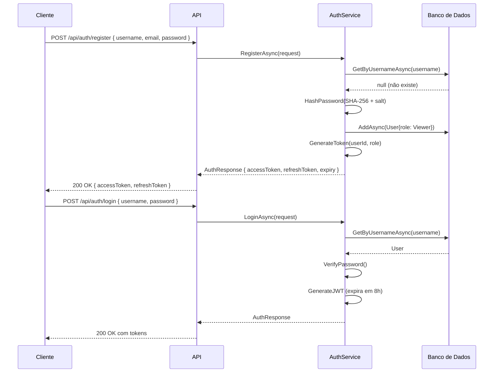
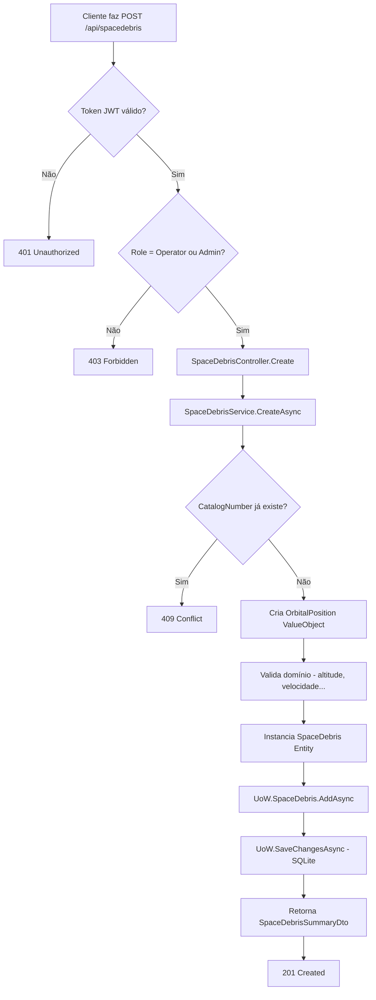
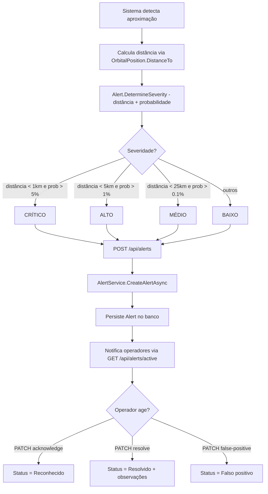
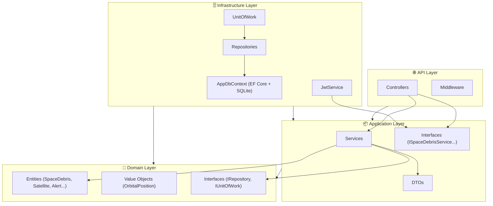
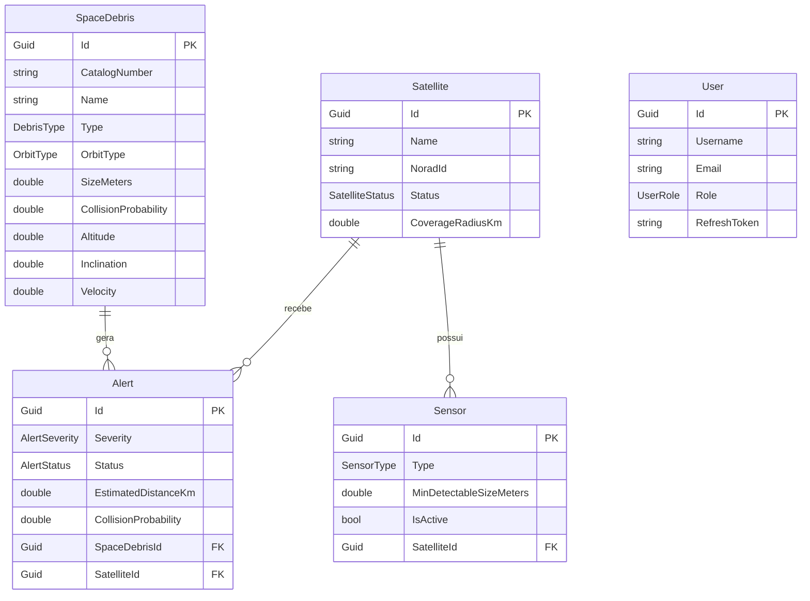

# Diagramas de Fluxo — Sistema de Monitoramento de Detritos Espaciais

## 1. Fluxo de Autenticação

## 2. Fluxo de Registro de Detrito Espacial

## 3. Fluxo de Geração de Alerta de Colisão

## 4. Arquitetura em Camadas (Clean Architecture)

## 5. Modelo de Domínio (ER Simplificado)

